# jjscatterstats: Comprehensive Scatter Plot Analysis

## Introduction to jjscatterstats

The `jjscatterstats` function is a powerful wrapper around
[`ggstatsplot::ggscatterstats()`](https://www.indrapatil.com/ggstatsplot/reference/ggscatterstats.html)
and
[`ggstatsplot::grouped_ggscatterstats()`](https://www.indrapatil.com/ggstatsplot/reference/grouped_ggscatterstats.html)
that provides comprehensive scatter plot analysis with statistical
testing capabilities. This function is particularly useful for exploring
relationships between continuous variables in clinical and research
settings.

### Key Features

- **Statistical Analysis**: Automatic correlation analysis with multiple
  statistical approaches
- **Flexible Grouping**: Support for grouped analysis across categorical
  variables
- **Multiple Statistical Types**: Parametric, non-parametric, robust,
  and Bayesian statistics
- **Customizable Visualization**: Extensive theming and labeling options
- **Performance Optimized**: Enhanced caching and data preparation for
  faster rendering

### Loading Required Libraries

``` r

library(jjstatsplot)
library(ggplot2)
library(dplyr)

# Load example datasets
data(iris)
data(mtcars)
```

## Basic Scatter Plot Analysis

### Simple Correlation Analysis

Let’s start with a basic scatter plot analyzing the relationship between
sepal length and petal length in the iris dataset:

``` r

# Basic scatter plot with parametric correlation
result_basic <- jjscatterstats(
  data = iris,
  dep = "Sepal.Length",
  group = "Petal.Length",
  typestatistics = "parametric",
  mytitle = "Sepal Length vs Petal Length",
  xtitle = "Sepal Length (cm)",
  ytitle = "Petal Length (cm)"
)

print(result_basic)
#> 
#>  SCATTER PLOT
#> 
#>  You have selected to use a scatter plot with correlation analysis.
```


### Different Statistical Approaches

#### Non-parametric Analysis

``` r

# Non-parametric correlation (Spearman's rho)
result_nonparam <- jjscatterstats(
  data = iris,
  dep = "Sepal.Length",
  group = "Petal.Width",
  typestatistics = "nonparametric",
  mytitle = "Non-parametric Correlation Analysis"
)

print(result_nonparam)
#> 
#>  SCATTER PLOT
#> 
#>  You have selected to use a scatter plot with correlation analysis.
```

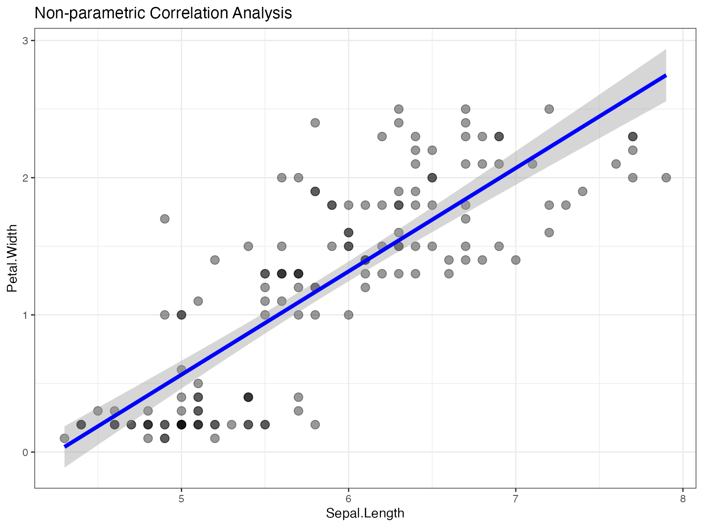

#### Robust Statistics

``` r

# Robust correlation analysis
result_robust <- jjscatterstats(
  data = iris,
  dep = "Sepal.Width",
  group = "Petal.Length",
  typestatistics = "robust",
  mytitle = "Robust Correlation Analysis"
)

print(result_robust)
#> 
#>  SCATTER PLOT
#> 
#>  You have selected to use a scatter plot with correlation analysis.
```

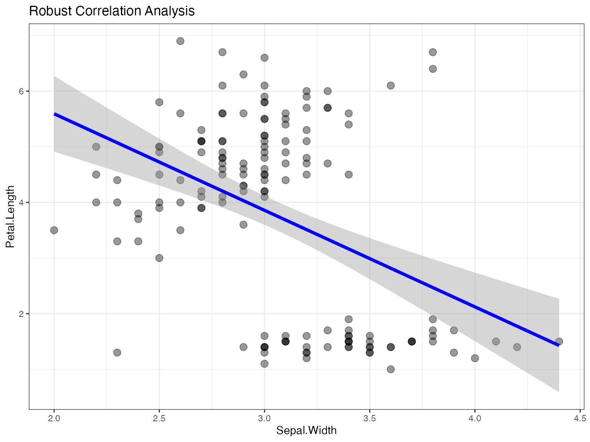

#### Bayesian Analysis

``` r

# Bayesian correlation analysis
result_bayes <- jjscatterstats(
  data = iris,
  dep = "Sepal.Length",
  group = "Sepal.Width",
  typestatistics = "bayes",
  mytitle = "Bayesian Correlation Analysis"
)

print(result_bayes)
#> 
#>  SCATTER PLOT
#> 
#>  You have selected to use a scatter plot with correlation analysis.
```

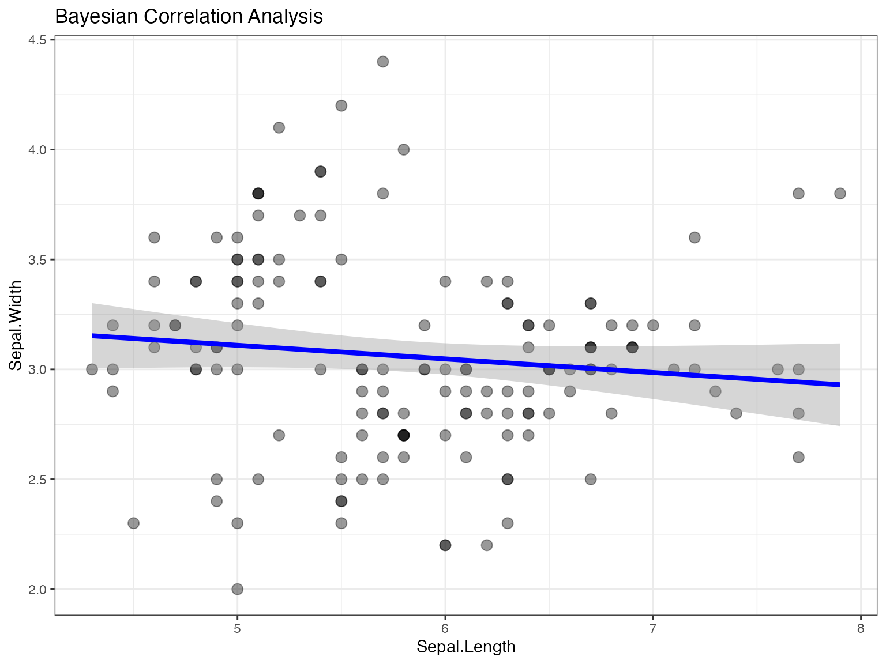

## Grouped Analysis

### Scatter Plot by Species

One of the most powerful features is the ability to create grouped
scatter plots:

``` r

# Grouped scatter plot by species
result_grouped <- jjscatterstats(
  data = iris,
  dep = "Sepal.Length",
  group = "Petal.Length",
  grvar = "Species",
  typestatistics = "parametric",
  mytitle = "Correlation Analysis by Species"
)

print(result_grouped)
#> 
#>  SCATTER PLOT
#> 
#>  You have selected to use a scatter plot with correlation analysis.
```

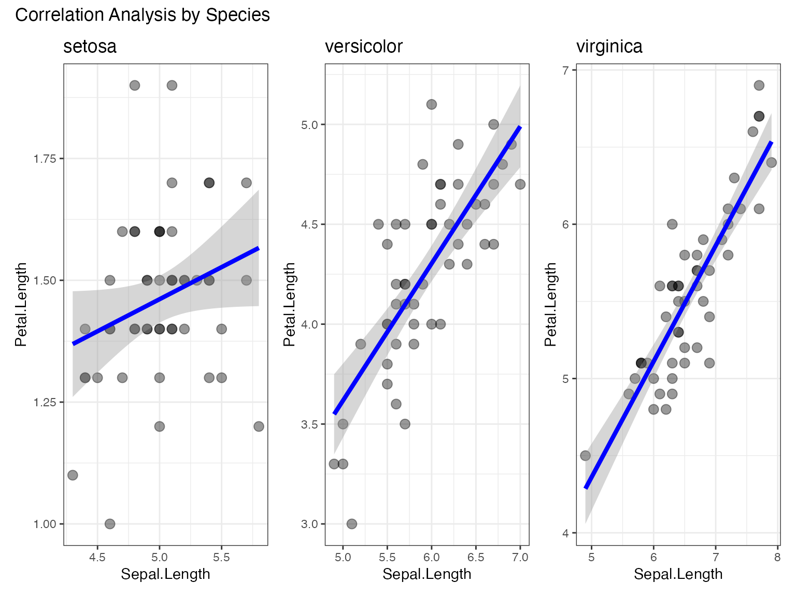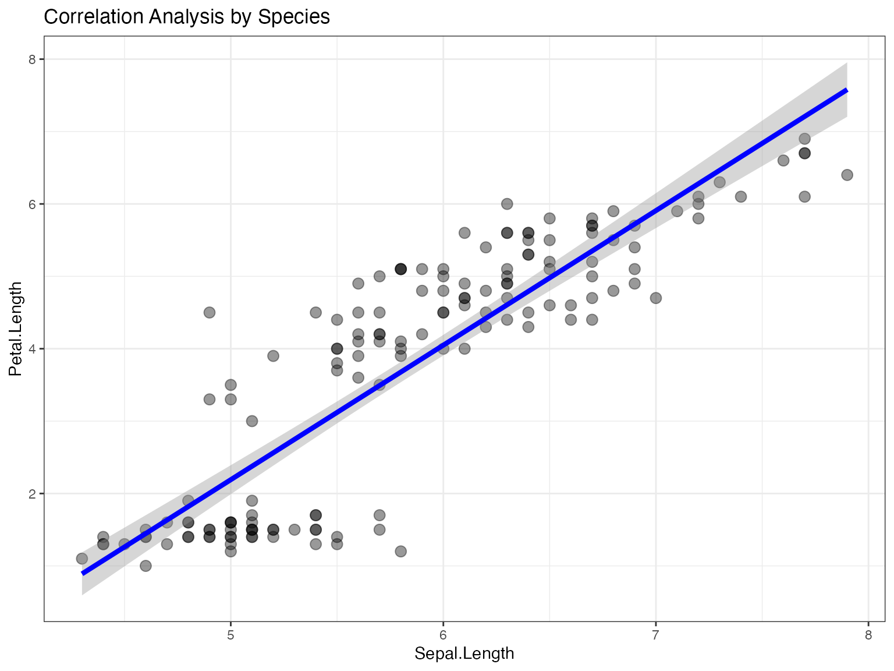

### Multiple Group Analysis with mtcars

``` r

# Prepare mtcars data
mtcars_modified <- mtcars %>%
  mutate(
    transmission = factor(am, levels = c(0, 1), labels = c("Automatic", "Manual")),
    cylinders = factor(cyl)
  )

# Grouped analysis of mpg vs horsepower by transmission type
result_mtcars <- jjscatterstats(
  data = mtcars_modified,
  dep = "hp",
  group = "mpg",
  grvar = "transmission",
  typestatistics = "parametric",
  mytitle = "MPG vs Horsepower by Transmission Type",
  xtitle = "Horsepower",
  ytitle = "Miles per Gallon"
)

print(result_mtcars)
#> 
#>  SCATTER PLOT
#> 
#>  You have selected to use a scatter plot with correlation analysis.
```

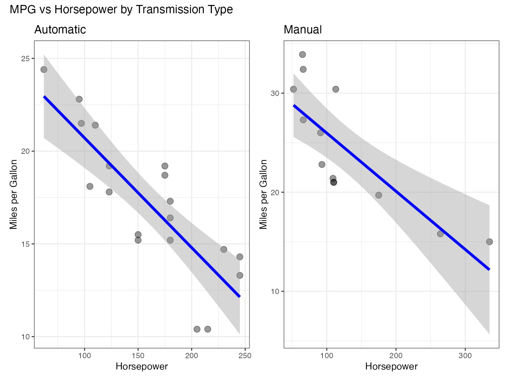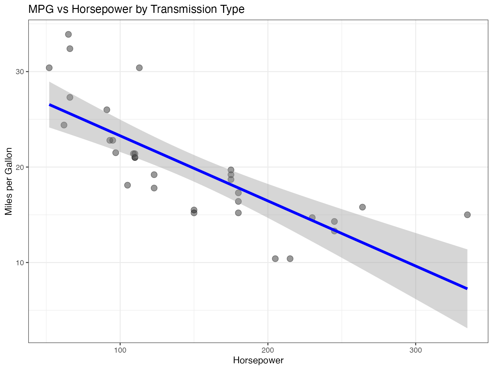

## Clinical Research Applications

### Using Clinical Test Data

``` r

# Example with clinical data (if available)
# This demonstrates typical clinical research scenarios

# Load clinical test data
data(jjscatterstats_clinical)

# Analyze tumor size vs Ki67 percentage
clinical_result <- jjscatterstats(
  data = jjscatterstats_clinical,
  dep = "tumor_size_mm",
  group = "ki67_percentage",
  grvar = "stage",
  typestatistics = "parametric",
  mytitle = "Tumor Size vs Ki67 by Cancer Stage",
  xtitle = "Tumor Size (mm)",
  ytitle = "Ki67 Percentage (%)"
)

print(clinical_result)
```

### Biomarker Correlation Analysis

``` r

# Biomarker correlation analysis
biomarker_result <- jjscatterstats(
  data = jjscatterstats_clinical,
  dep = "mutation_count",
  group = "survival_months",
  grvar = "histology",
  typestatistics = "nonparametric",
  mytitle = "Mutation Count vs Survival by Histology",
  xtitle = "Mutation Count",
  ytitle = "Survival (months)"
)

print(biomarker_result)
```

## Advanced Customization

### Theme Customization

``` r

# Using original ggstatsplot theme
result_original_theme <- jjscatterstats(
  data = iris,
  dep = "Sepal.Length",
  group = "Petal.Length",
  originaltheme = TRUE,
  mytitle = "Original ggstatsplot Theme"
)

print(result_original_theme)
#> 
#>  SCATTER PLOT
#> 
#>  You have selected to use a scatter plot with correlation analysis.
```

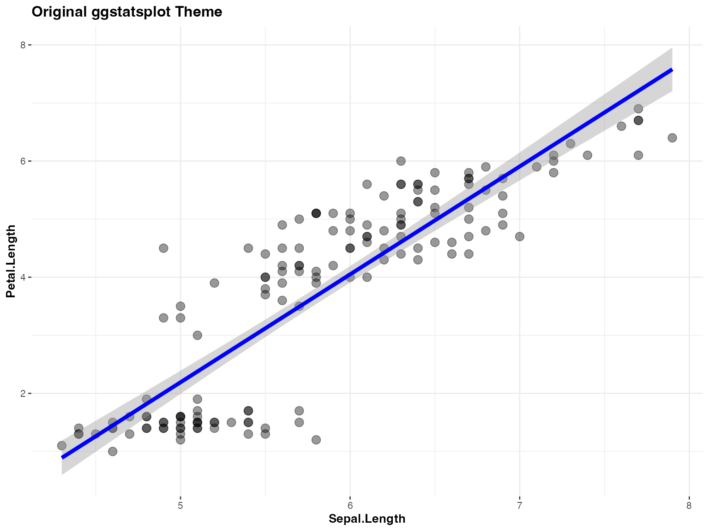

### Custom Labels and Titles

``` r

# Comprehensive labeling
result_labeled <- jjscatterstats(
  data = mtcars,
  dep = "wt",
  group = "mpg",
  typestatistics = "parametric",
  mytitle = "Vehicle Weight vs Fuel Efficiency",
  xtitle = "Weight (1000 lbs)",
  ytitle = "Miles per Gallon",
  resultssubtitle = TRUE
)

print(result_labeled)
#> 
#>  SCATTER PLOT
#> 
#>  You have selected to use a scatter plot with correlation analysis.
```

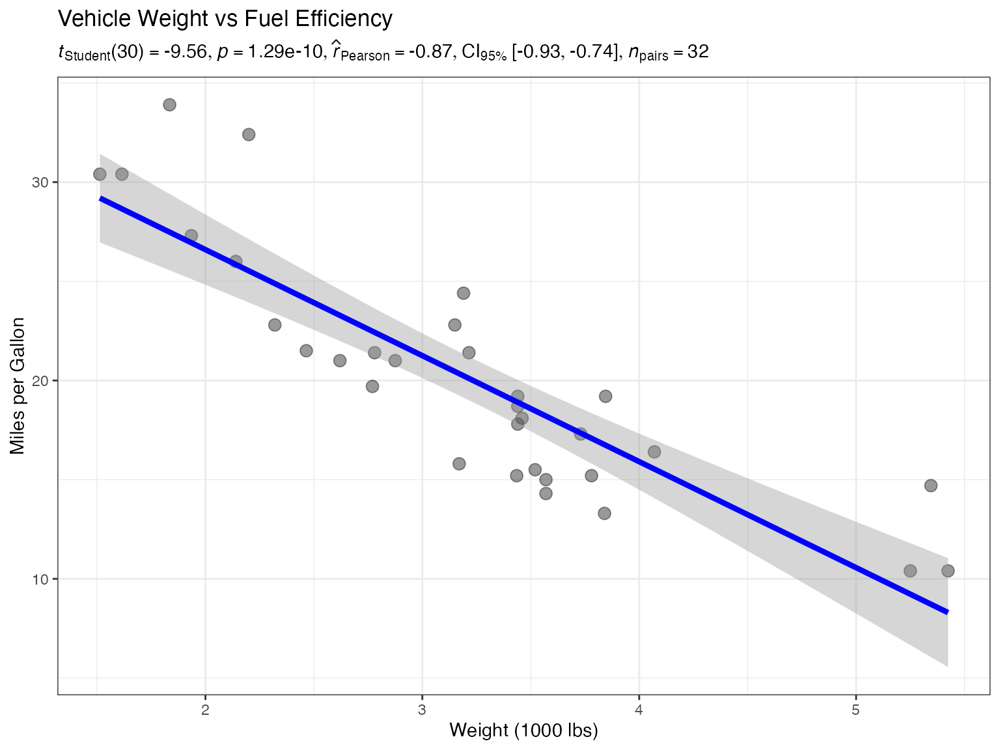

### Controlling Statistical Results Display

``` r

# Hide statistical results subtitle
result_no_stats <- jjscatterstats(
  data = iris,
  dep = "Sepal.Width",
  group = "Petal.Width",
  typestatistics = "parametric",
  mytitle = "Clean Plot Without Statistics",
  resultssubtitle = FALSE
)

print(result_no_stats)
#> 
#>  SCATTER PLOT
#> 
#>  You have selected to use a scatter plot with correlation analysis.
```

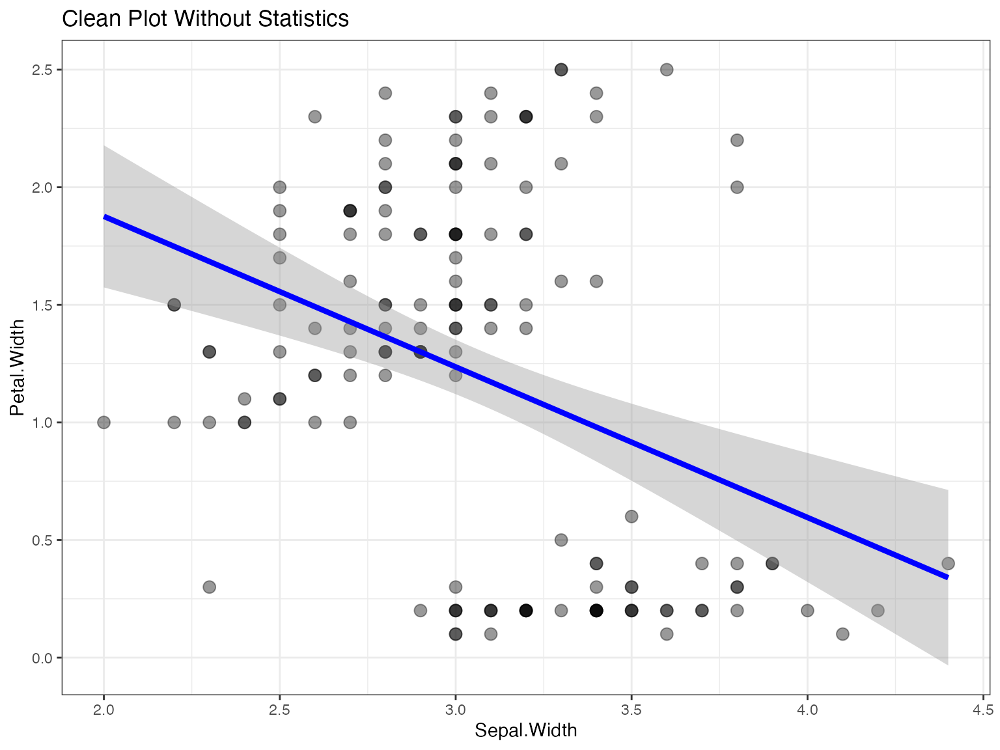

## Performance Considerations

### Large Dataset Handling

The function includes several performance optimizations:

``` r

# Performance test with larger dataset
data(jjscatterstats_performance)

# This should render efficiently due to optimizations
start_time <- Sys.time()
performance_result <- jjscatterstats(
  data = jjscatterstats_performance,
  dep = "measurement_1",
  group = "measurement_2",
  grvar = "lab_id",
  typestatistics = "parametric",
  mytitle = "Performance Test - Large Dataset"
)
end_time <- Sys.time()

cat("Rendering time:", difftime(end_time, start_time, units = "secs"), "seconds\n")
print(performance_result)
```

### Data Caching and Optimization

The function implements several performance enhancements:

1.  **Data Preparation Caching**: Processed data is cached to avoid
    recomputation
2.  **Option Preprocessing**: Common option processing is done once and
    cached
3.  **Hash-based Change Detection**: Only reprocesses data when inputs
    change
4.  **Efficient Memory Usage**: Minimizes data copying and
    transformation overhead

## Edge Cases and Data Validation

### Handling Missing Values

``` r

# Create data with missing values
iris_with_na <- iris
iris_with_na[1:10, "Sepal.Length"] <- NA
iris_with_na[15:20, "Petal.Length"] <- NA

# Function automatically handles missing values
result_na <- jjscatterstats(
  data = iris_with_na,
  dep = "Sepal.Length",
  group = "Petal.Length",
  typestatistics = "parametric",
  mytitle = "Handling Missing Values"
)

print(result_na)
#> 
#>  SCATTER PLOT
#> 
#>  You have selected to use a scatter plot with correlation analysis.
```

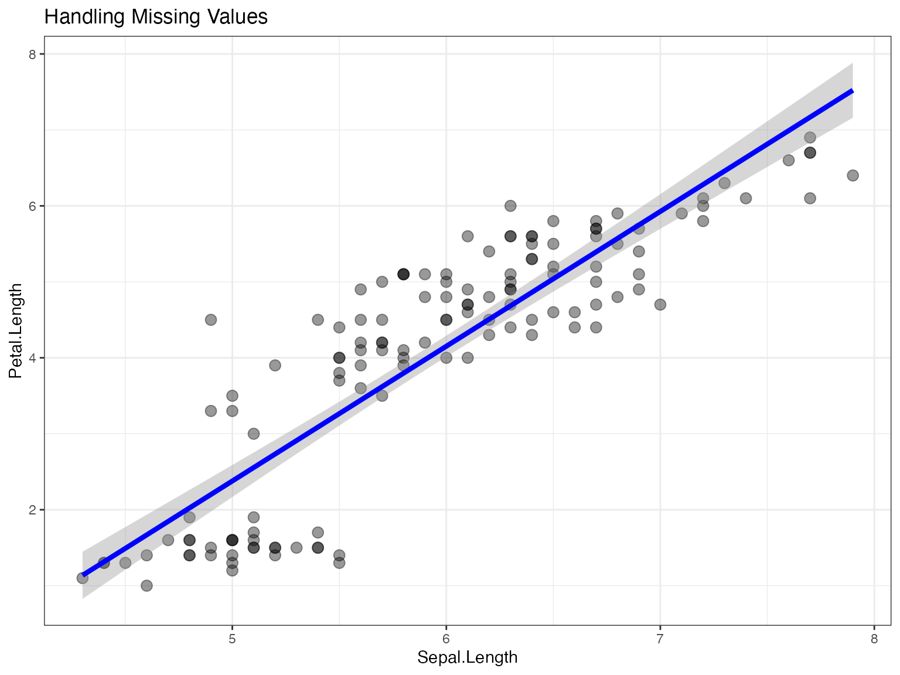

### Input Validation

``` r

# Example of error handling
try({
  result_error <- jjscatterstats(
    data = data.frame(),  # Empty dataset
    dep = "nonexistent",
    group = "variable",
    typestatistics = "parametric"
  )
})
#> Error : Argument 'dep' contains 'nonexistent' which is not present in the dataset
```

## Best Practices and Recommendations

### Statistical Type Selection

- **Parametric**: Use when data is normally distributed (Pearson
  correlation)
- **Non-parametric**: Use for non-normal data or ordinal variables
  (Spearman correlation)
- **Robust**: Use when data has outliers (percentage bend correlation)
- **Bayesian**: Use for incorporating prior knowledge or uncertainty
  quantification

### Visualization Guidelines

1.  **Choose appropriate variables**: Both x and y should be continuous
2.  **Consider grouping**: Use grouping variables to reveal subgroup
    patterns
3.  **Label clearly**: Always provide meaningful titles and axis labels
4.  **Statistical reporting**: Include statistical results unless
    specifically hiding them

### Performance Tips

1.  **Large datasets**: The function is optimized for datasets up to
    several thousand rows
2.  **Multiple analyses**: Reuse data objects when possible to benefit
    from caching
3.  **Grouping variables**: Limit grouping variables to reasonable
    numbers of levels (\< 10)

## Troubleshooting Common Issues

### Variable Type Issues

``` r

# Ensure variables are numeric
str(iris[c("Sepal.Length", "Petal.Length")])
#> 'data.frame':    150 obs. of  2 variables:
#>  $ Sepal.Length: num  5.1 4.9 4.7 4.6 5 5.4 4.6 5 4.4 4.9 ...
#>  $ Petal.Length: num  1.4 1.4 1.3 1.5 1.4 1.7 1.4 1.5 1.4 1.5 ...

# The function automatically converts to numeric, but it's good practice to check
```

### Memory and Performance

``` r

# For very large datasets, consider:
# 1. Sampling your data first
set.seed(123)
sampled_data <- iris[sample(nrow(iris), 100), ]

result_sampled <- jjscatterstats(
  data = sampled_data,
  dep = "Sepal.Length",
  group = "Petal.Length",
  typestatistics = "parametric"
)

# 2. Using simpler statistical methods for initial exploration
result_simple <- jjscatterstats(
  data = iris,
  dep = "Sepal.Length",
  group = "Petal.Length",
  typestatistics = "parametric",
  resultssubtitle = FALSE  # Faster rendering
)
```

## Summary

The `jjscatterstats` function provides a comprehensive solution for
scatter plot analysis with:

- Multiple statistical testing approaches
- Flexible grouping capabilities
- Performance optimizations for larger datasets
- Extensive customization options
- Robust error handling and validation

This makes it an excellent choice for exploratory data analysis,
clinical research, and statistical reporting in the jamovi environment.

### Function Reference

For complete parameter documentation, see:

- [ggstatsplot::ggscatterstats](https://indrajeetpatil.github.io/ggstatsplot/reference/ggscatterstats.html)
- [ggstatsplot::grouped_ggscatterstats](https://indrajeetpatil.github.io/ggstatsplot/reference/grouped_ggscatterstats.html)

``` r

# Session information
sessionInfo()
#> R version 4.6.0 (2026-04-24)
#> Platform: aarch64-apple-darwin23
#> Running under: macOS Tahoe 26.5.2
#> 
#> Matrix products: default
#> BLAS:   /Library/Frameworks/R.framework/Versions/4.6/Resources/lib/libRblas.0.dylib 
#> LAPACK: /Library/Frameworks/R.framework/Versions/4.6/Resources/lib/libRlapack.dylib;  LAPACK version 3.12.1
#> 
#> locale:
#> [1] en_US.UTF-8/en_US.UTF-8/en_US.UTF-8/C/en_US.UTF-8/en_US.UTF-8
#> 
#> time zone: Europe/Istanbul
#> tzcode source: internal
#> 
#> attached base packages:
#> [1] stats     graphics  grDevices utils     datasets  methods   base     
#> 
#> other attached packages:
#> [1] dplyr_1.2.1           ggplot2_4.0.3         jjstatsplot_1.0.53.01
#> 
#> loaded via a namespace (and not attached):
#>   [1] ggstatsplot_1.0.0         splines_4.6.0            
#>   [3] later_1.4.8               tibble_3.3.1             
#>   [5] ggpp_0.6.1                jmvcore_2.7.38           
#>   [7] polyclip_1.10-7           datawizard_1.3.1         
#>   [9] hardhat_1.4.3             rpart_4.1.27             
#>  [11] ggExtra_0.11.0            lifecycle_1.0.5          
#>  [13] rstatix_1.1.0             globals_0.19.1           
#>  [15] lattice_0.22-9            MASS_7.3-66              
#>  [17] insight_1.5.2             ggdist_3.3.3             
#>  [19] backports_1.5.1           magrittr_2.0.5           
#>  [21] sass_0.4.10               rmarkdown_2.31           
#>  [23] jquerylib_0.1.4           yaml_2.3.12              
#>  [25] httpuv_1.6.17             otel_0.2.0               
#>  [27] cowplot_1.2.0             pbapply_1.7-4            
#>  [29] RColorBrewer_1.1-3        easyalluvial_0.4.1       
#>  [31] lubridate_1.9.5           multcomp_1.4-31          
#>  [33] abind_1.4-8               purrr_1.2.2              
#>  [35] nnet_7.3-21               TH.data_1.1-5            
#>  [37] tweenr_2.0.3              sandwich_3.1-3           
#>  [39] ipred_0.9-15              lava_1.9.2               
#>  [41] ggrepel_0.9.8             listenv_1.0.0            
#>  [43] correlation_0.8.8         moments_0.14.1           
#>  [45] MatrixModels_0.5-4        parallelly_1.48.0        
#>  [47] pkgdown_2.2.1             codetools_0.2-20         
#>  [49] DT_0.34.0                 ggforce_0.5.0            
#>  [51] tidyselect_1.2.1          farver_2.1.2             
#>  [53] viridis_0.6.5             effectsize_1.0.3         
#>  [55] WRS2_1.1-7                jsonlite_2.0.0           
#>  [57] progressr_1.0.0           Formula_1.2-6            
#>  [59] ggridges_0.5.7            ggalluvial_0.12.6        
#>  [61] survival_3.8-9            emmeans_2.0.4            
#>  [63] systemfonts_1.3.2         tools_4.6.0              
#>  [65] waffle_1.0.2              ragg_1.5.2               
#>  [67] Rcpp_1.1.2                glue_1.8.1               
#>  [69] prodlim_2026.03.11        gridExtra_2.3.1          
#>  [71] Rttf2pt1_1.3.14           xfun_0.60                
#>  [73] mgcv_1.9-4                distributional_0.8.1     
#>  [75] ggsegmentedtotalbar_0.1.0 withr_3.0.3              
#>  [77] fastmap_1.2.0             boot_1.3-32              
#>  [79] digest_0.6.39             timechange_0.4.0         
#>  [81] R6_2.6.1                  mime_0.13                
#>  [83] estimability_2.0.0        ggprism_1.0.7            
#>  [85] textshaping_1.0.5         ggrain_0.1.2             
#>  [87] tidyr_1.3.2               generics_0.1.4           
#>  [89] data.table_1.18.4         recipes_1.3.3            
#>  [91] class_7.3-24              htmlwidgets_1.6.4        
#>  [93] parameters_0.29.2         pkgconfig_2.0.3          
#>  [95] gtable_0.3.6              timeDate_4052.112        
#>  [97] statsExpressions_2.0.0    S7_0.2.2                 
#>  [99] BayesFactor_0.9.12-4.8    htmltools_0.5.9          
#> [101] carData_3.0-6             scales_1.4.0             
#> [103] gower_1.0.2               knitr_1.51               
#> [105] coda_0.19-4.1             nlme_3.1-170             
#> [107] curl_7.1.0                cachem_1.1.0             
#> [109] zoo_1.9-0                 stringr_1.6.0            
#> [111] parallel_4.6.0            miniUI_0.1.2             
#> [113] extrafont_0.20            desc_1.4.3               
#> [115] pillar_1.11.1             grid_4.6.0               
#> [117] reshape_0.8.10            vctrs_0.7.3              
#> [119] promises_1.5.0            ggpubr_1.0.0             
#> [121] car_3.1-5                 xtable_1.8-8             
#> [123] extrafontdb_1.1           paletteer_1.7.0          
#> [125] evaluate_1.0.5            mvtnorm_1.4-2            
#> [127] cli_3.6.6                 compiler_4.6.0           
#> [129] rlang_1.3.0               rstantools_2.7.0         
#> [131] future.apply_1.20.2       ggsignif_0.6.4           
#> [133] labeling_0.4.3            rematch2_2.1.2           
#> [135] plyr_1.8.9                forcats_1.0.1            
#> [137] fs_2.1.0                  stringi_1.8.9            
#> [139] viridisLite_0.4.3         bayestestR_0.18.1        
#> [141] Matrix_1.7-6              hms_1.1.4                
#> [143] patchwork_1.3.2           future_1.75.0            
#> [145] shiny_1.14.0              haven_2.5.5              
#> [147] igraph_2.3.3              broom_1.0.13             
#> [149] RcppParallel_6.2.0        bslib_0.12.0             
#> [151] polynom_1.4-1
```
