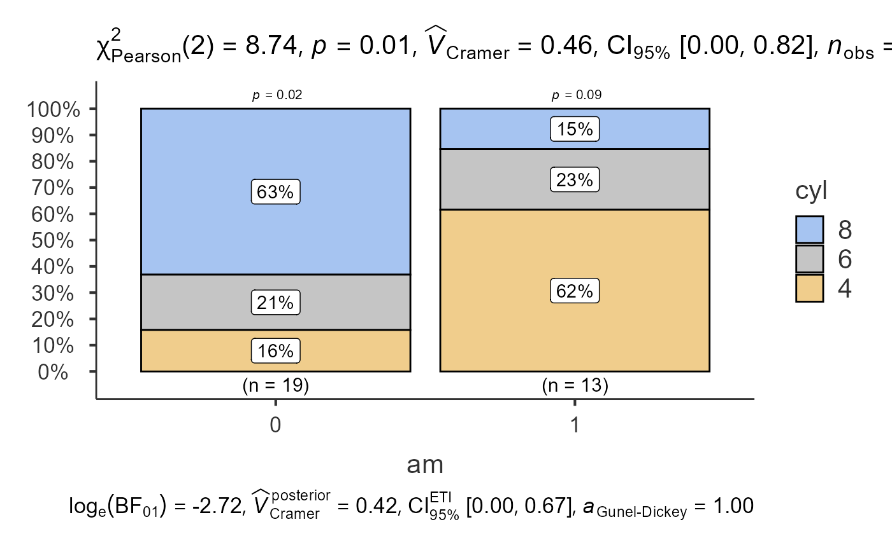
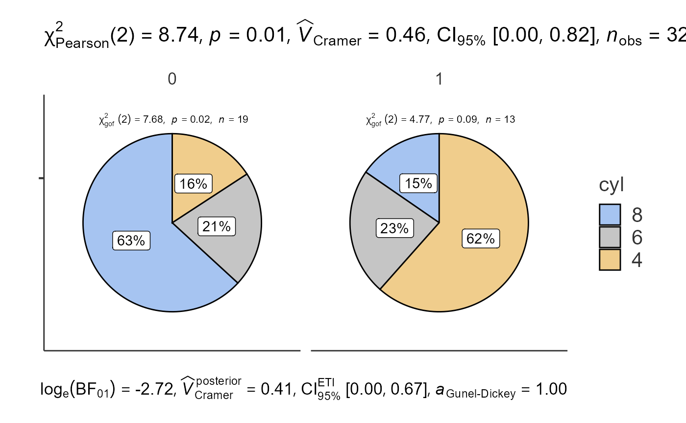
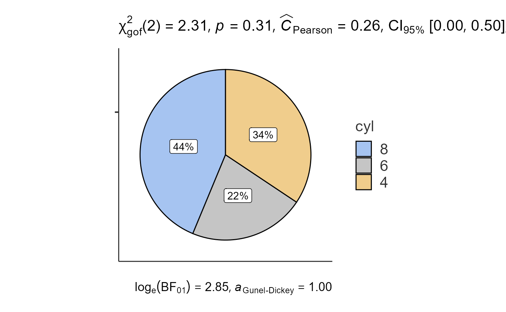
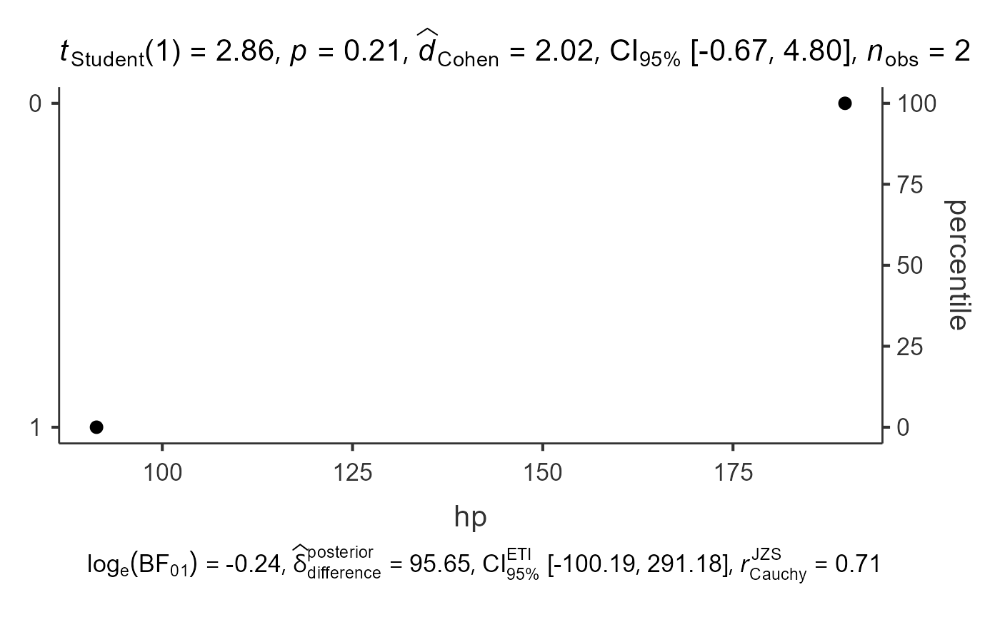

# Categorical Plot Functions

This vignette demonstrates the functions designed for categorical data:
[`jjbarstats()`](https://www.serdarbalci.com/jjstatsplot/reference/jjbarstats.md),
[`jjpiestats()`](https://www.serdarbalci.com/jjstatsplot/reference/jjpiestats.md)
and
[`jjdotplotstats()`](https://www.serdarbalci.com/jjstatsplot/reference/jjdotplotstats.md).

## Bar charts with `jjbarstats()`

[`jjbarstats()`](https://www.serdarbalci.com/jjstatsplot/reference/jjbarstats.md)
creates a bar chart and automatically performs a chi-squared test to
compare the distribution of two categorical variables. The example below
compares the number of cylinders (`cyl`) across transmission types
(`am`).

``` r

jjbarstats(data = mtcars, dep = cyl, group = am, grvar = NULL)
#> 
#>  BAR CHARTS
#> 
#>  You have selected to use a barplot to compare a categorical variable
#>  with another.
```



## Pie charts with `jjpiestats()`

[`jjpiestats()`](https://www.serdarbalci.com/jjstatsplot/reference/jjpiestats.md)
is similar to
[`jjbarstats()`](https://www.serdarbalci.com/jjstatsplot/reference/jjbarstats.md)
but displays the results as a pie chart.

``` r

jjpiestats(data = mtcars, dep = cyl, group = am, grvar = NULL)
#> 
#>  PIE CHARTS
#> 
#>  You have selected to use Pie Charts.
```



## Dot charts with `jjdotplotstats()`

[`jjdotplotstats()`](https://www.serdarbalci.com/jjstatsplot/reference/jjdotplotstats.md)
shows group means using a dot plot. In this example we plot horsepower
(`hp`) by engine configuration (`vs`).

``` r

jjdotplotstats(data = mtcars, dep = hp, group = vs, grvar = NULL)
#> 
#>  DOT CHART
#> 
#>  You have selected to use a Dot Plot to compare continuous variables by
#>  groups.
```



Each function returns a results object whose `plot` element contains the
`ggplot2` visualisation.
