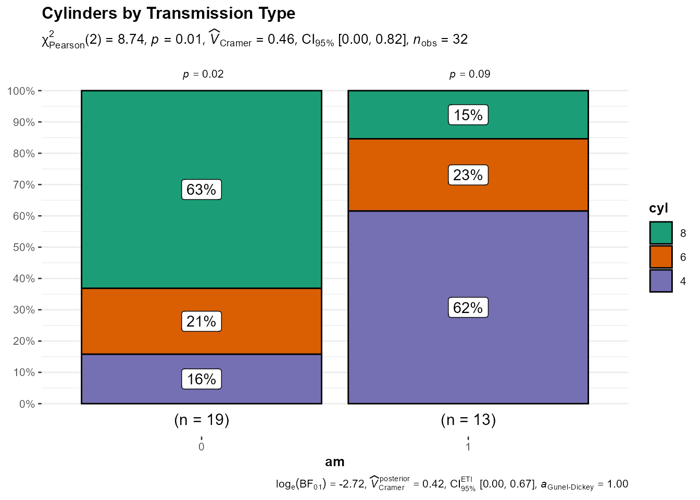
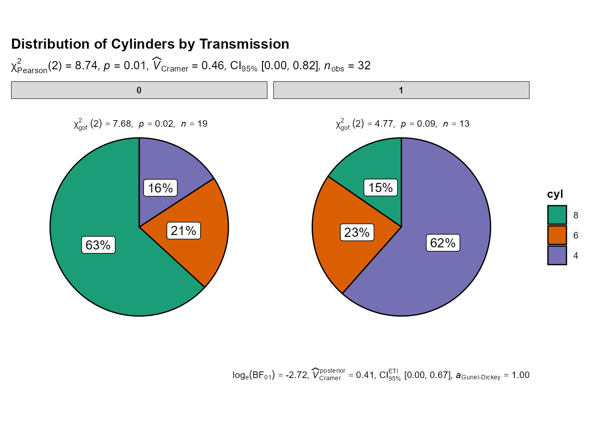
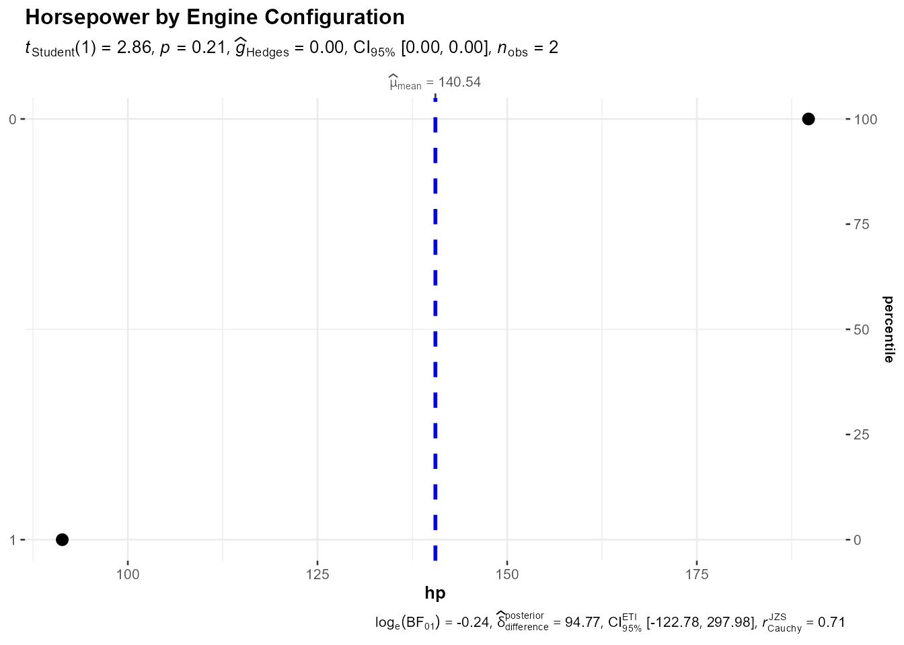
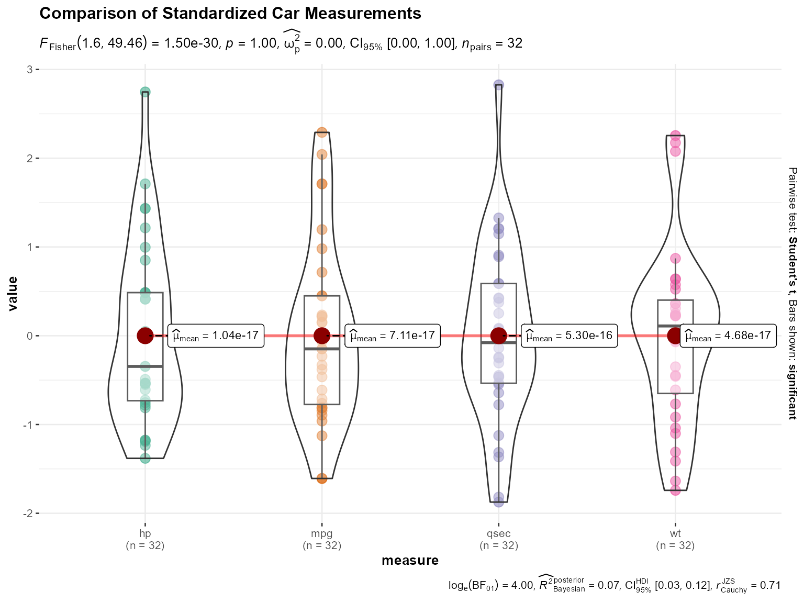

# Categorical Plot Functions

This vignette demonstrates the categorical plot functions available in
the jjstatsplot package. These functions are designed to work within the
jamovi interface, but we can demonstrate their underlying functionality
using the ggstatsplot functions they wrap.

## Bar charts with `jjbarstats()`

The
[`jjbarstats()`](https://www.serdarbalci.com/jjstatsplot/reference/jjbarstats.md)
function creates bar charts and performs chi-squared tests to compare
categorical variables. It wraps
[`ggstatsplot::ggbarstats()`](https://indrajeetpatil.github.io/ggstatsplot/reference/ggbarstats.html).

``` r

# Underlying function that jjbarstats() wraps
ggstatsplot::ggbarstats(
  data = mtcars,
  x = cyl,
  y = am,
  title = "Cylinders by Transmission Type"
)
```



## Pie charts with `jjpiestats()`

The
[`jjpiestats()`](https://www.serdarbalci.com/jjstatsplot/reference/jjpiestats.md)
function creates pie charts for categorical data visualization. It wraps
[`ggstatsplot::ggpiestats()`](https://indrajeetpatil.github.io/ggstatsplot/reference/ggpiestats.html).

``` r

# Underlying function that jjpiestats() wraps
ggstatsplot::ggpiestats(
  data = mtcars,
  x = cyl,
  y = am,
  title = "Distribution of Cylinders by Transmission"
)
```



## Dot charts with `jjdotplotstats()`

The
[`jjdotplotstats()`](https://www.serdarbalci.com/jjstatsplot/reference/jjdotplotstats.md)
function shows group comparisons using dot plots. It wraps
[`ggstatsplot::ggdotplotstats()`](https://indrajeetpatil.github.io/ggstatsplot/reference/ggdotplotstats.html).

``` r

# Underlying function that jjdotplotstats() wraps
ggstatsplot::ggdotplotstats(
  data = mtcars,
  x = hp,
  y = vs,
  title = "Horsepower by Engine Configuration"
)
```



## Within-group comparisons with `jjwithinstats()`

The
[`jjwithinstats()`](https://www.serdarbalci.com/jjstatsplot/reference/jjwithinstats.md)
function compares repeated measurements within groups. It wraps
[`ggstatsplot::ggwithinstats()`](https://indrajeetpatil.github.io/ggstatsplot/reference/ggwithinstats.html).

``` r

# Create long format data for within-group comparison
library(tidyr)
mtcars_long <- mtcars %>%
  select(mpg, hp, wt, qsec) %>%
  mutate(id = row_number()) %>%
  pivot_longer(cols = c(mpg, hp, wt, qsec), 
               names_to = "measure", 
               values_to = "value") %>%
  # Standardize values for comparison
  group_by(measure) %>%
  mutate(value = scale(value)[,1]) %>%
  ungroup()

# Underlying function that jjwithinstats() wraps
ggstatsplot::ggwithinstats(
  data = mtcars_long,
  x = measure,
  y = value,
  paired = TRUE,
  id = id,
  title = "Comparison of Standardized Car Measurements"
)
```



## Usage in jamovi

These functions are designed to be used through the jamovi graphical
interface, where they provide:

- Interactive parameter selection
- Automatic data type handling
- Integrated results display
- Export capabilities

To use these functions in jamovi:

1.  Install the jjstatsplot module
2.  Load your data
3.  Navigate to the JJStatsPlot menu
4.  Select the appropriate plot type
5.  Configure variables and options through the interface

The jamovi interface handles parameter validation, data preprocessing,
and result presentation automatically.
