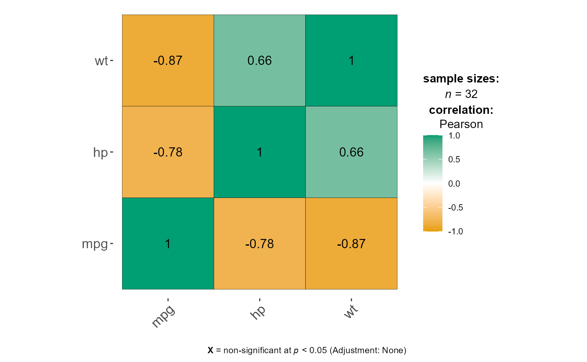
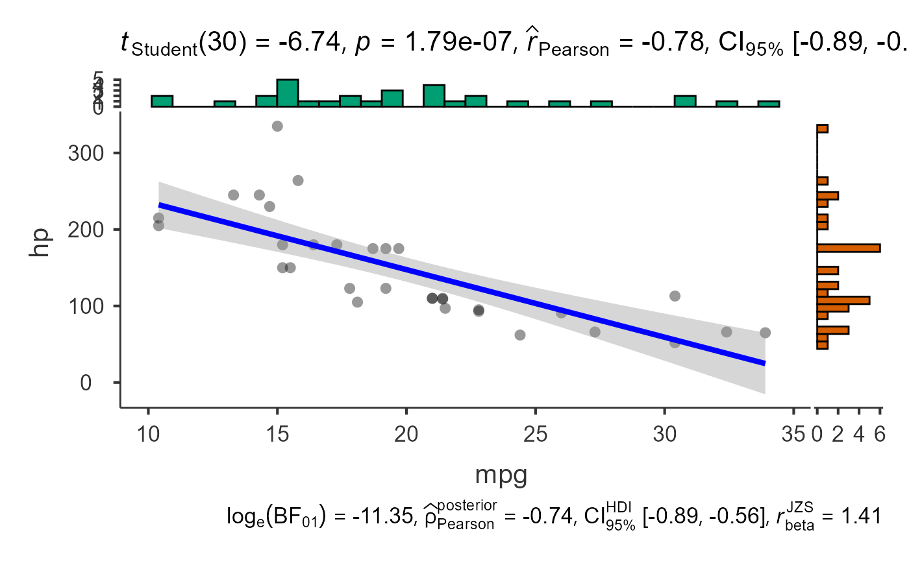

# Correlations and Scatter Plots

This vignette covers
[`jjcorrmat()`](https://www.serdarbalci.com/jjstatsplot/reference/jjcorrmat.md)
for creating correlation matrices and
[`jjscatterstats()`](https://www.serdarbalci.com/jjstatsplot/reference/jjscatterstats.md)
for scatter plots.

## Correlation matrices with `jjcorrmat()`

[`jjcorrmat()`](https://www.serdarbalci.com/jjstatsplot/reference/jjcorrmat.md)
visualises pairwise correlations between numeric variables and reports
the associated tests. Here we look at the relationships between `mpg`,
`hp` and `wt` in the `mtcars` data.

``` r

jjcorrmat(data = mtcars, dep = c(mpg, hp, wt), grvar = NULL)
#> 
#>  CORRELATION MATRIX
#> 
#>  You have selected to use a correlation matrix to compare continuous
#>  variables.
```



## Scatter plots with `jjscatterstats()`

[`jjscatterstats()`](https://www.serdarbalci.com/jjstatsplot/reference/jjscatterstats.md)
produces a scatter plot with a regression line and textual output
describing the correlation and regression statistics.

``` r

jjscatterstats(data = mtcars, dep = mpg, group = hp, grvar = NULL)
#> 
#>  SCATTER PLOT
#> 
#>  You have selected to use a scatter plot.
```


