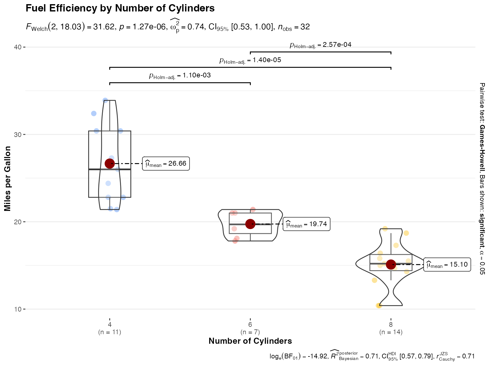
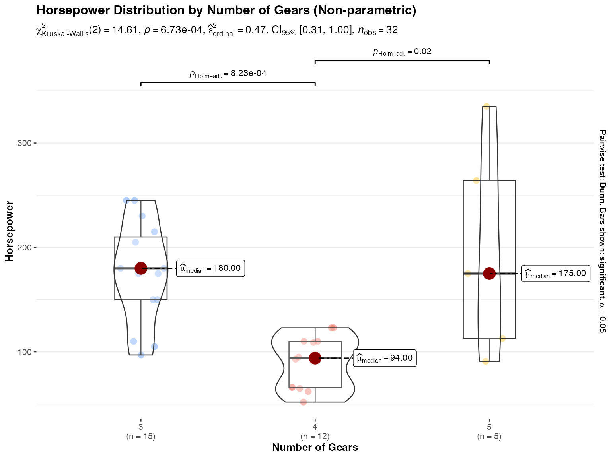
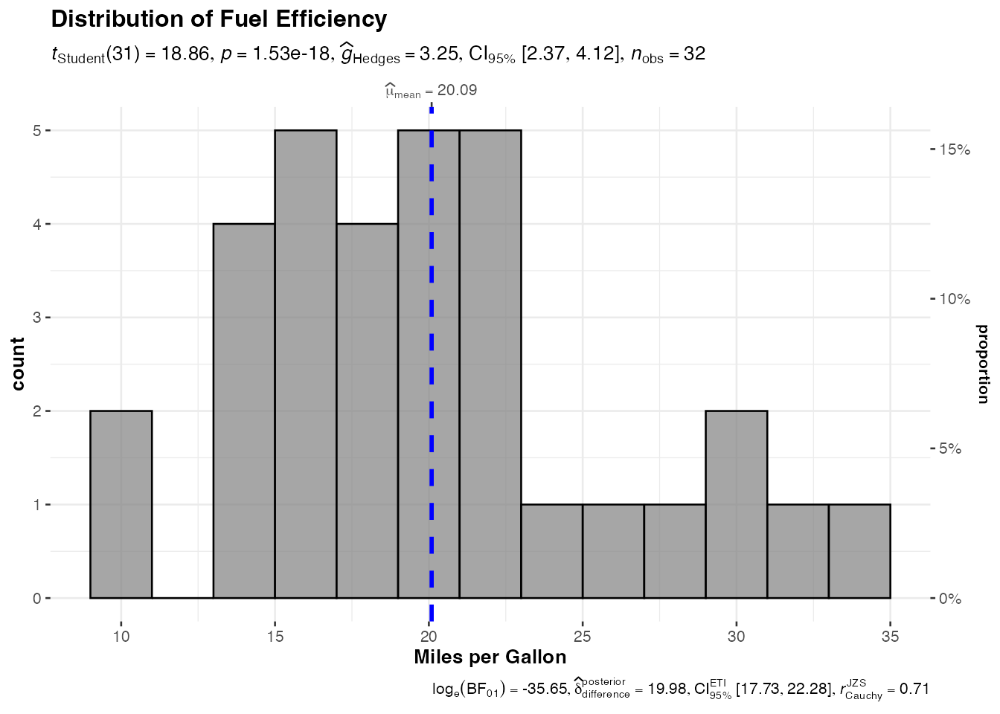
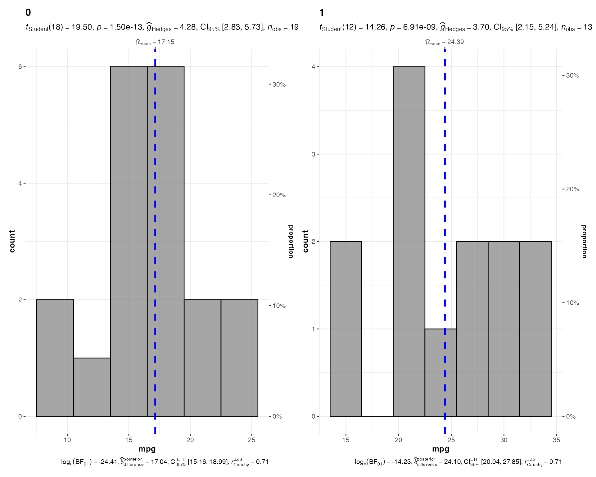
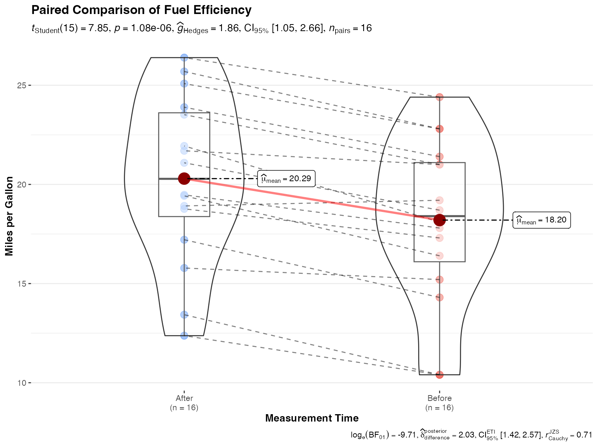
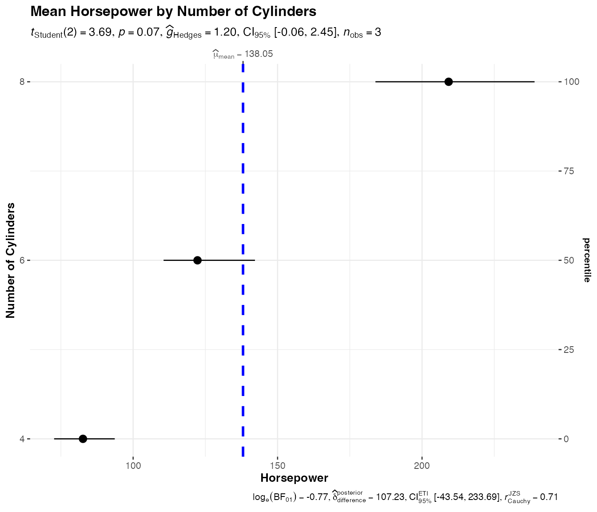
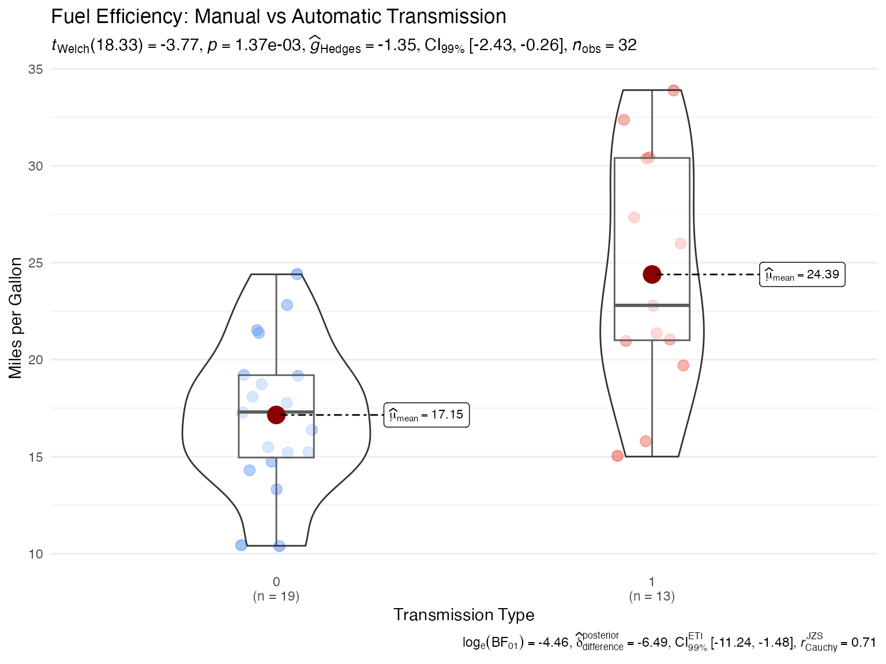

# Continuous Variable Comparisons

This vignette demonstrates functions for analyzing and visualizing
continuous variables in the jjstatsplot package. These functions provide
comprehensive statistical analyses alongside publication-ready plots.

## Between-group comparisons with `jjbetweenstats()`

The
[`jjbetweenstats()`](https://www.serdarbalci.com/jjstatsplot/reference/jjbetweenstats.md)
function creates box-violin plots to compare continuous variables
between independent groups. It automatically performs appropriate
statistical tests (parametric, non-parametric, robust, or Bayesian) and
displays the results.

``` r

# Underlying function that jjbetweenstats() wraps
ggstatsplot::ggbetweenstats(
  data = mtcars,
  x = cyl,
  y = mpg,
  type = "parametric",
  pairwise.comparisons = TRUE,
  pairwise.display = "significant",
  centrality.plotting = TRUE,
  title = "Fuel Efficiency by Number of Cylinders",
  xlab = "Number of Cylinders",
  ylab = "Miles per Gallon"
)
```



### Customizing the analysis type

You can choose different types of statistical analyses:

``` r

# Non-parametric analysis with Kruskal-Wallis test
ggstatsplot::ggbetweenstats(
  data = mtcars,
  x = gear,
  y = hp,
  type = "nonparametric",
  centrality.plotting = TRUE,
  centrality.type = "nonparametric",
  title = "Horsepower Distribution by Number of Gears (Non-parametric)",
  xlab = "Number of Gears",
  ylab = "Horsepower"
)
```



## Histograms with `jjhistostats()`

The
[`jjhistostats()`](https://www.serdarbalci.com/jjstatsplot/reference/jjhistostats.md)
function creates histograms with overlaid density curves and statistical
test results against a specified test value.

``` r

# Underlying function that jjhistostats() wraps
ggstatsplot::gghistostats(
  data = mtcars,
  x = mpg,
  type = "parametric",
  normal.curve = TRUE,
  binwidth = 2,
  title = "Distribution of Fuel Efficiency",
  xlab = "Miles per Gallon"
)
```



### Grouped histograms

You can also create histograms split by a grouping variable:

``` r

# Grouped histogram
ggstatsplot::grouped_gghistostats(
  data = mtcars,
  x = mpg,
  grouping.var = am,
  binwidth = 3,
  title.prefix = "Transmission Type",
  normal.curve = TRUE
)
```



## Within-group comparisons with `jjwithinstats()`

The
[`jjwithinstats()`](https://www.serdarbalci.com/jjstatsplot/reference/jjwithinstats.md)
function is designed for repeated measures or paired comparisons. It
shows individual trajectories and performs appropriate paired tests.

``` r

# Create paired data for demonstration
library(tidyr)
library(dplyr)
#> 
#> Attaching package: 'dplyr'
#> The following objects are masked from 'package:stats':
#> 
#>     filter, lag
#> The following objects are masked from 'package:base':
#> 
#>     intersect, setdiff, setequal, union

# Simulate paired measurements (e.g., before and after treatment)
paired_data <- data.frame(
  id = rep(1:16, 2),
  condition = rep(c("Before", "After"), each = 16),
  value = c(mtcars$mpg[1:16], mtcars$mpg[1:16] + rnorm(16, mean = 2, sd = 1))
)

# Underlying function that jjwithinstats() wraps
ggstatsplot::ggwithinstats(
  data = paired_data,
  x = condition,
  y = value,
  paired = TRUE,
  id = id,
  type = "parametric",
  pairwise.comparisons = TRUE,
  title = "Paired Comparison of Fuel Efficiency",
  xlab = "Measurement Time",
  ylab = "Miles per Gallon"
)
```



## Dot plots with `jjdotplotstats()`

The
[`jjdotplotstats()`](https://www.serdarbalci.com/jjstatsplot/reference/jjdotplotstats.md)
function creates Cleveland dot plots showing group means or medians with
confidence intervals. This is particularly useful for comparing multiple
groups when you want to emphasize the central tendency and uncertainty.

``` r

# Underlying function that jjdotplotstats() wraps
ggstatsplot::ggdotplotstats(
  data = mtcars,
  x = hp,
  y = cyl,
  type = "parametric",
  centrality.plotting = TRUE,
  title = "Mean Horsepower by Number of Cylinders",
  xlab = "Horsepower",
  ylab = "Number of Cylinders"
)
```



## Statistical details

All these functions provide:

1.  **Automatic statistical testing**: Based on the `type` parameter,
    appropriate tests are selected:
    - Parametric: t-test, ANOVA, paired t-test
    - Non-parametric: Mann-Whitney U, Kruskal-Wallis, Wilcoxon
      signed-rank
    - Robust: Yuen’s trimmed means test, heteroscedastic ANOVA
    - Bayesian: Bayes Factor analysis
2.  **Effect sizes**: Appropriate effect size measures are computed and
    displayed:
    - Cohen’s d, Hedge’s g (for t-tests)
    - Eta-squared, omega-squared (for ANOVA)
    - r (for non-parametric tests)
3.  **Pairwise comparisons**: When comparing multiple groups, post-hoc
    pairwise comparisons are available with p-value adjustment methods.

## Usage in jamovi

These functions are integrated into the jamovi interface where they
provide:

- Point-and-click variable selection
- Interactive options for customizing plots
- Automatic handling of missing data
- Export options for plots and results

To use these in jamovi:

1.  Install the jjstatsplot module from the jamovi library
2.  Load your dataset
3.  Navigate to JJStatsPlot → Continuous menu
4.  Select the appropriate analysis
5.  Configure options through the user-friendly interface

## Advanced customization

While the jamovi interface provides the most common options, R users can
access additional customization through the underlying ggstatsplot
functions:

``` r

# Example with extensive customization
ggstatsplot::ggbetweenstats(
  data = mtcars,
  x = am,
  y = mpg,
  type = "parametric",
  # Visual customization
  violin.args = list(width = 0.5, alpha = 0.2),
  boxplot.args = list(width = 0.2, alpha = 0.5),
  point.args = list(alpha = 0.5, size = 3, position = position_jitter(width = 0.1)),
  # Statistical options
  conf.level = 0.99,
  effsize.type = "unbiased",
  # Theming
  ggtheme = ggplot2::theme_minimal(),
  # Labels
  title = "Fuel Efficiency: Manual vs Automatic Transmission",
  subtitle = "99% confidence intervals shown",
  xlab = "Transmission Type",
  ylab = "Miles per Gallon",
  caption = "Data: Motor Trend Car Road Tests"
)
```



## Summary

The continuous comparison functions in jjstatsplot provide:

- Comprehensive statistical analyses with minimal code
- Publication-ready visualizations
- Automatic selection of appropriate statistical tests
- Integration with jamovi’s graphical interface
- Flexibility for advanced R users

These tools make it easy to perform rigorous statistical comparisons
while creating informative visualizations suitable for both exploration
and presentation.
