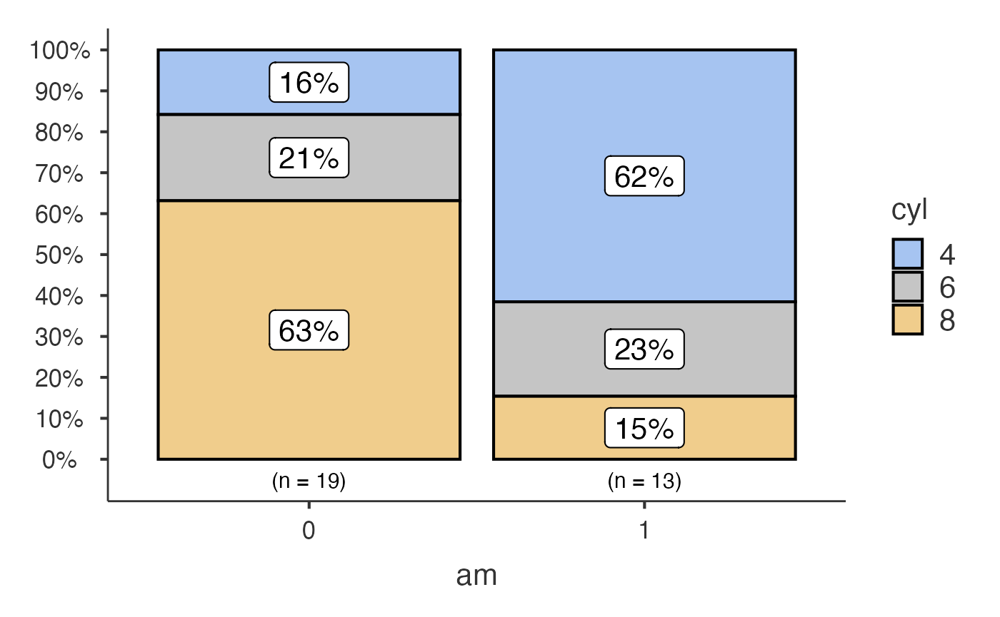
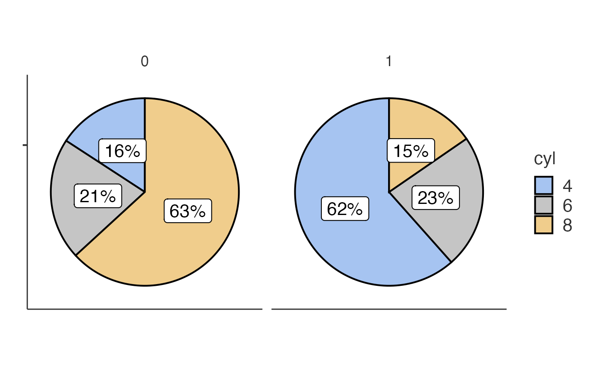
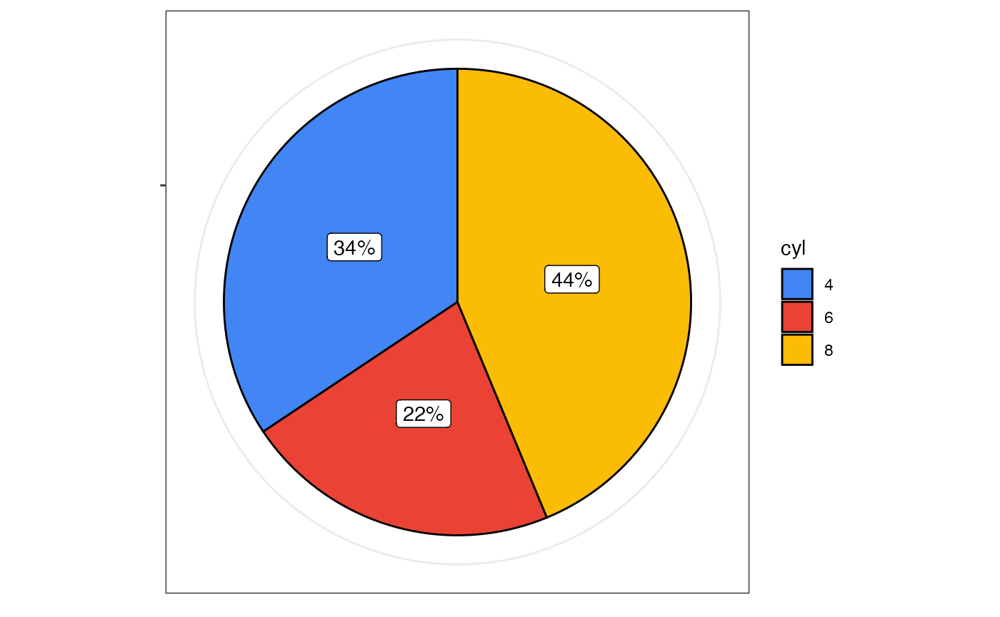
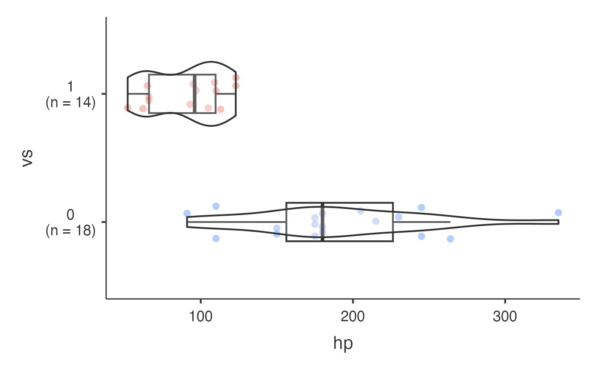

# Categorical Plot Functions

This vignette demonstrates the functions designed for categorical data:
[`jjbarstats()`](https://www.serdarbalci.com/jjstatsplot/reference/jjbarstats.md),
[`jjpiestats()`](https://www.serdarbalci.com/jjstatsplot/reference/jjpiestats.md)
and
[`jjdotplotstats()`](https://www.serdarbalci.com/jjstatsplot/reference/jjdotplotstats.md).

## Bar charts with `jjbarstats()`

[`jjbarstats()`](https://www.serdarbalci.com/jjstatsplot/reference/jjbarstats.md)
creates a bar chart and automatically performs a chi-squared test to
compare the distribution of two categorical variables. The example below
compares the number of cylinders (`cyl`) across transmission types
(`am`).

``` r

jjbarstats(data = mtcars, dep = cyl, group = am, grvar = NULL)
#> Warning in chisq.test(cross_table): Chi-squared approximation may be incorrect
#> Warning in private$.validateStatisticalRequirements(dep_vars, group_var):
#> Variable ' cyl ' vs ' am ': Chi-square expected count assumption violated (some
#> cells < 5).
#> 
#>  BAR CHARTS
#> 
#>  <div style='padding: 15px; background-color: #f8f9fa; border-left: 4px
#>  solid #007bff; margin: 10px 0;'><h4 style='color: #007bff; margin-top:
#>  0;'> About Bar Chart Analysis
#> 
#>  Purpose: Compare the distribution of categorical variables across
#>  groups using statistical testing.
#> 
#>  When to Use:
#> 
#>  Diagnostic Tests: Compare test results (positive/negative) across
#>  patient groupsTreatment Response: Analyze response rates across
#>  different treatmentsBiomarker Expression: Compare expression levels
#>  (low/medium/high) by clinical factorsRisk Factor Analysis: Examine how
#>  risk factors relate to outcomes
#> 
#>  Output Includes:
#> 
#>  Visual bar chart with statistical annotationsChi-square or appropriate
#>  statistical test resultsEffect size measures and confidence
#>  intervalsPost-hoc pairwise comparisons (when >2 groups)
#> 
#> character(0)
#> 
#> character(0)
#> 
#> character(0)
#> 
#>  Bar chart analysis comparing cyl by am.
#> 
#>  Data prepared: 32 observations (missing values will be handled by
#>  statistical functions) (cached).
#> Warning: The `size` argument of `element_line()` is deprecated as of ggplot2 3.4.0.
#> ℹ Please use the `linewidth` argument instead.
#> ℹ The deprecated feature was likely used in the jmvcore package.
#>   Please report the issue at <https://github.com/jamovi/jamovi/issues>.
#> This warning is displayed once per session.
#> Call `lifecycle::last_lifecycle_warnings()` to see where this warning was
#> generated.
```



## Pie charts with `jjpiestats()`

[`jjpiestats()`](https://www.serdarbalci.com/jjstatsplot/reference/jjpiestats.md)
is similar to
[`jjbarstats()`](https://www.serdarbalci.com/jjstatsplot/reference/jjbarstats.md)
but displays the results as a pie chart.

``` r

jjpiestats(data = mtcars, dep = cyl, group = am, grvar = NULL)
#> 
#>  PIE CHARTS
#> 
#> character(0)
#> 
#> character(0)
#> 
#>  Pie chart analysis ready Variable: cyl, grouped by am.
#> 
#>  Data prepared: 32 observations (cached).
#> 
#>  Statistical method: Parametric analysis.
```



## Dot charts with `jjdotplotstats()`

[`jjdotplotstats()`](https://www.serdarbalci.com/jjstatsplot/reference/jjdotplotstats.md)
shows group means using a dot plot. In this example we plot horsepower
(`hp`) by engine configuration (`vs`).

``` r

jjdotplotstats(data = mtcars, dep = hp, group = vs, grvar = NULL)
#> 
#>  DOT CHART
#> 
#>  Processing data for dot plot analysis...
#> 
#>  1 potential outlier(s) detected in hp
#> 
#>  Analysis summary: 2 groups, 32 total observations
#> 
#> character(0)
```



Each function returns a results object whose `plot` element contains the
`ggplot2` visualisation.
