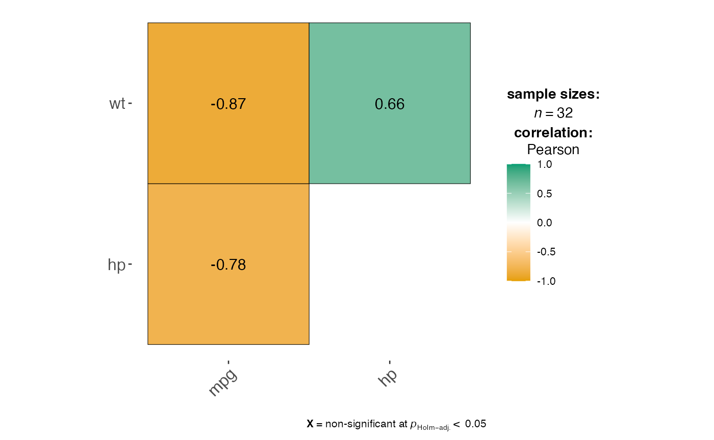
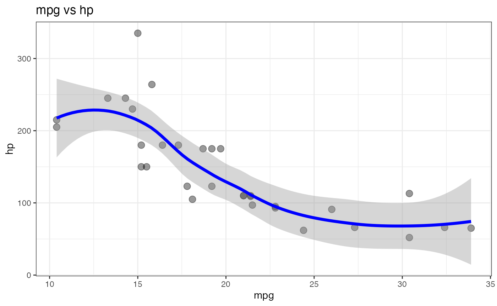

# Correlations and Scatter Plots

This vignette covers
[`jjcorrmat()`](https://www.serdarbalci.com/jjstatsplot/reference/jjcorrmat.md)
for creating correlation matrices and
[`jjscatterstats()`](https://www.serdarbalci.com/jjstatsplot/reference/jjscatterstats.md)
for scatter plots.

## Correlation matrices with `jjcorrmat()`

[`jjcorrmat()`](https://www.serdarbalci.com/jjstatsplot/reference/jjcorrmat.md)
visualises pairwise correlations between numeric variables and reports
the associated tests. Here we look at the relationships between `mpg`,
`hp` and `wt` in the `mtcars` data.

``` r

jjcorrmat(data = mtcars, dep = c(mpg, hp, wt), grvar = NULL)
#> 
#>  CORRELATION MATRIX
#> 
#>  Preparing correlation analysis options...
#> 
#> character(0)
#> 
#>  Correlation Table                                                                                             
#>  ───────────────────────────────────────────────────────────────────────────────────────────────────────────── 
#>    Variable 1    Variable 2    r / rho       p-value         CI Lower      CI Upper      Method        Group   
#>  ───────────────────────────────────────────────────────────────────────────────────────────────────────────── 
#>    mpg           hp            -0.7800000    1.787835e -7    -0.8852686    -0.5860994    parametric    All     
#>    mpg           wt            -0.8700000    1.293959e-10    -0.9338264    -0.7440872    parametric    All     
#>    hp            wt             0.6600000    4.145827e -5     0.4025113     0.8192573    parametric    All     
#>  ─────────────────────────────────────────────────────────────────────────────────────────────────────────────
#> Warning: The `size` argument of `element_line()` is deprecated as of ggplot2 3.4.0.
#> ℹ Please use the `linewidth` argument instead.
#> ℹ The deprecated feature was likely used in the jmvcore package.
#>   Please report the issue at <https://github.com/jamovi/jamovi/issues>.
#> This warning is displayed once per session.
#> Call `lifecycle::last_lifecycle_warnings()` to see where this warning was
#> generated.
```



## Scatter plots with `jjscatterstats()`

[`jjscatterstats()`](https://www.serdarbalci.com/jjstatsplot/reference/jjscatterstats.md)
produces a scatter plot with a regression line and textual output
describing the correlation and regression statistics.

``` r

jjscatterstats(data = mtcars, dep = mpg, group = hp, grvar = NULL)
#> 
#>  SCATTER PLOT
#> 
#>  You have selected to use a scatter plot with correlation analysis.
```


