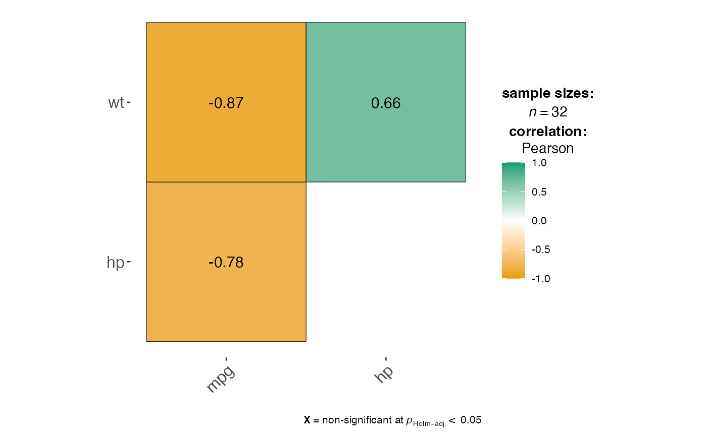
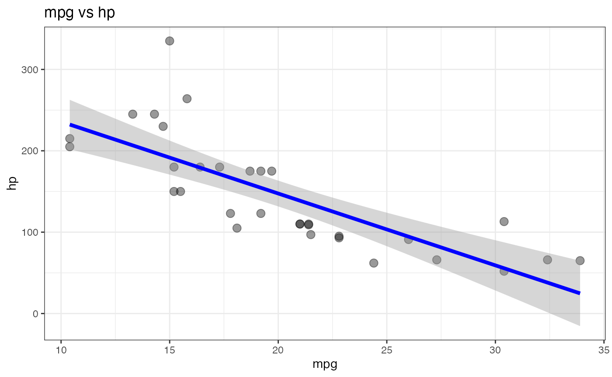

# Correlations and Scatter Plots

This vignette covers
[`jjcorrmat()`](https://www.serdarbalci.com/jjstatsplot/reference/jjcorrmat.md)
for creating correlation matrices and
[`jjscatterstats()`](https://www.serdarbalci.com/jjstatsplot/reference/jjscatterstats.md)
for scatter plots.

## Correlation matrices with `jjcorrmat()`

[`jjcorrmat()`](https://www.serdarbalci.com/jjstatsplot/reference/jjcorrmat.md)
visualises pairwise correlations between numeric variables and reports
the associated tests. Here we look at the relationships between `mpg`,
`hp` and `wt` in the `mtcars` data.

``` r

jjcorrmat(data = mtcars, dep = c(mpg, hp, wt), grvar = NULL)
#> 
#>  CORRELATION MATRIX
#> 
#>  You have selected to use a correlation matrix to compare continuous
#>  variables.
#> 
#>  <div style='margin: 10px 0;'><div style='background-color: #d1ecf1;
#>  border-left: 4px solid #0c5460; padding: 10px; margin: 5px 0;
#>  border-radius: 4px;'><strong style='color: #0c5460;'> INFO: <span
#>  style='color: #0c5460;'>Computed 3 zero-order Pearson correlations of
#>  3 variables.
#> 
#> character(0)
#> 
#>  Correlation Table                                                                                                                  
#>  ────────────────────────────────────────────────────────────────────────────────────────────────────────────────────────────────── 
#>    Variable 1    Variable 2    N     Coefficient    Lower         Upper         p             p (adjusted)    Method                
#>  ────────────────────────────────────────────────────────────────────────────────────────────────────────────────────────────────── 
#>    mpg           hp            32     -0.7761684    -0.8852686    -0.5860994     0.0000002       0.0000004    Pearson correlation   
#>    mpg           wt            32     -0.8676594    -0.9338264    -0.7440872    < .0000001    < .0000001    Pearson correlation   
#>    hp            wt            32      0.6587479     0.4025113     0.8192573     0.0000415       0.0000415    Pearson correlation   
#>  ────────────────────────────────────────────────────────────────────────────────────────────────────────────────────────────────── 
#>    Note. <b>p (adjusted)</b> applies the Holm correction across all pairwise tests. This is the p-value the plot uses to mark
#>    cells as non-significant at 0.05.
```



## Scatter plots with `jjscatterstats()`

[`jjscatterstats()`](https://www.serdarbalci.com/jjstatsplot/reference/jjscatterstats.md)
produces a scatter plot with a regression line and textual output
describing the correlation and regression statistics.

``` r

jjscatterstats(data = mtcars, dep = mpg, group = hp, grvar = NULL)
#> 
#>  SCATTER PLOT
#> 
#>  You have selected to use a scatter plot with correlation analysis.
```


